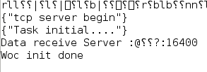
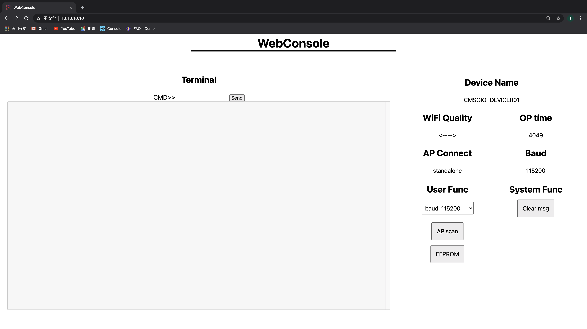
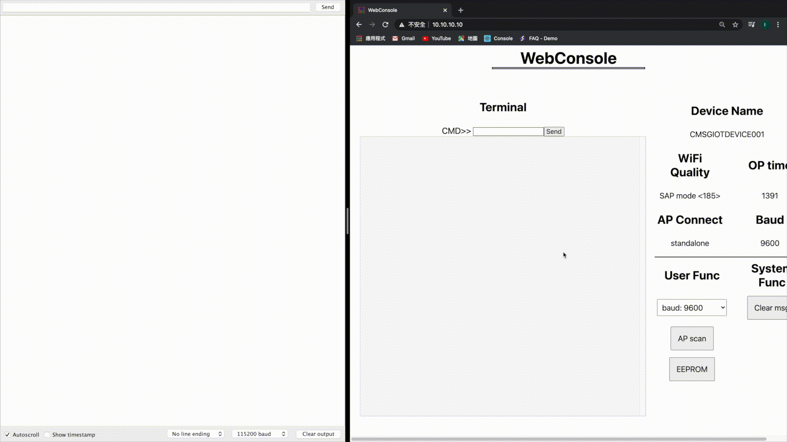
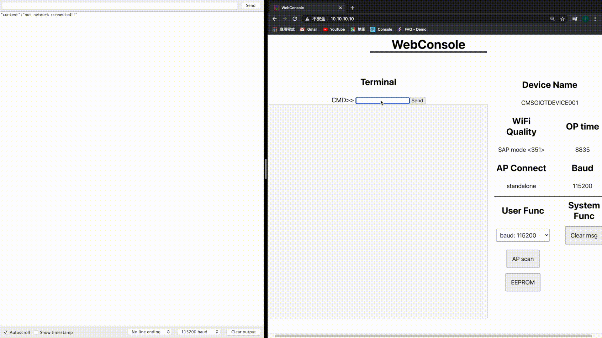
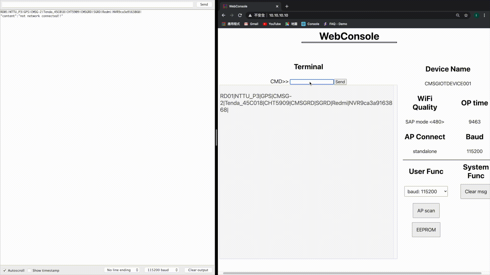
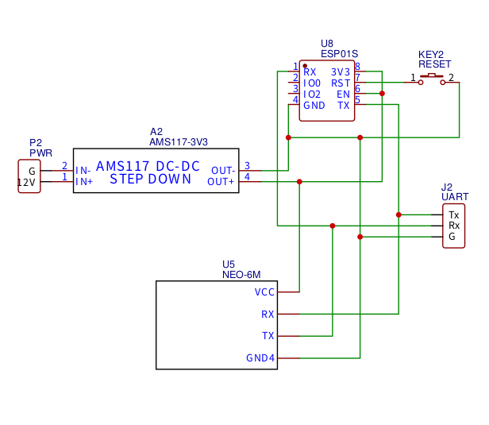
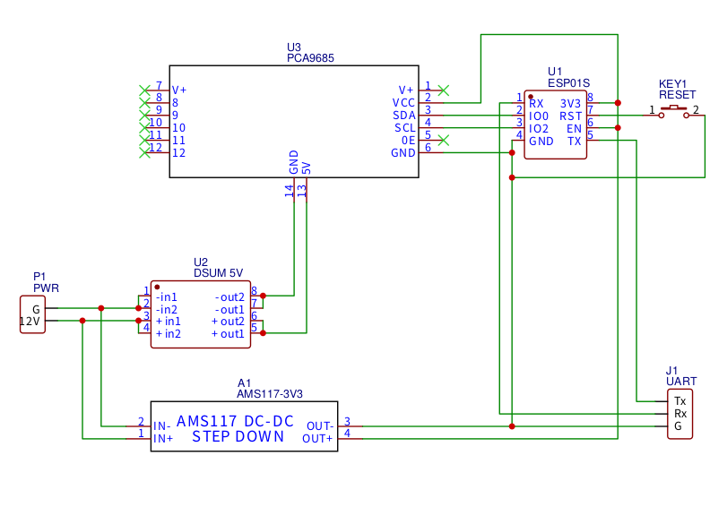

# ESP Web Console

[](https://gitter.im/ESP-Web-Console/Hall?utm_source=badge&utm_medium=badge&utm_campaign=pr-badge&utm_content=badge)

ESP Web Console is **simple**, **standalone**, **customizable web**, **realtime control/monitor** with WebSocket.

In this demo we use **ESP-01S**, but the firmware of core can be use on ESP8266 series.

This firmware is mainly for someone who want to upgrade your device(Arduino) with ESP8266, Control and Monitor everything on the Web !

Make your own IoT project with Web App, and share your ideas to everyone on the gitter!

[Demo Video](https://youtu.be/gDIvdp5f2U4)

[More Documents on gitbook](https://doc.sgiot.com.tw)


## Features

- **Create your own styled web**.
- **Baud setting** on the web.
- Max connection of 3~4 devices on the same time.
- Use **WebSocket** to control instead of AT-command.
- Provide **AP/AP+STA WiFi Mode**, free to switch standalone/internet usage.
- **Actively send data** to taget server.
- **RealTime transfer data** with serial port(TX/RX) between ESP8266 and other device like Arduino.

## Restriction

These problem will be optimized in the future!

- Recommend File size of each static files(js,css,html...) after gzip are <7KB.
- Too much js files request on the same time are not recommend.
- Input command too fast will lost sometimes.
- In AP+STA Mode, if the target server not response, the connection will be unstabled.
- Not allowed local network to access ESP8266.

## Installation

We provide some combinations to use, Basic and Custom firmware is for ESP-01S.

For other modules you can use the core and upload web files.

### firmware spec

|                                                                Firmware                                                                 |     Module      | Memory address |               Description                |
| :-------------------------------------------------------------------------------------------------------------------------------------: | :-------------: | :------------: | :--------------------------------------: |
|  [ESPWC_Main_Simple_1MB_FS192KB.bin](https://github.com/cmsg-iot/ESP-Web-Console/blob/main/ESPWC_Main_Simple_1MB_FS192KB.bin?raw=true)  |     ESP-01S     |    0x00000     |        Simple Web UI + ESPWC_Main        |
|  [ESPWC_Main_Custom_1MB_FS192KB.bin](https://github.com/cmsg-iot/ESP-Web-Console/blob/main/ESPWC_Main_Custom_1MB_FS192KB.bin?raw=true)  |     ESP-01S     |    0x00000     |        Custom Web UI +ESPWC_Main         |
| [ESPWC_Servo_Simple_1MB_FS192KB.bin](https://github.com/cmsg-iot/ESP-Web-Console/blob/main/ESPWC_Servo_Simple_1MB_FS192KB.bin?raw=true) |     ESP-01S     |    0x00000     |       Simple Web UI + ESPWC_Servo        |
| [ESPWC_Servo_Custom_1MB_FS192KB.bin](https://github.com/cmsg-iot/ESP-Web-Console/blob/main/ESPWC_Servo_Custom_1MB_FS192KB.bin?raw=true) |     ESP-01S     |    0x00000     |        Custom Web UI +ESPWC_Servo        |
|   core / [ESPWC_Main_1MB_FS192KB.bin](https://github.com/cmsg-iot/ESP-Web-Console/blob/main/core/ESPWC_Main_1MB_FS192KB.bin?raw=true)   | ESP-01 ~ ESP-14 |    0x00000     |        Config for ESP8266, active        |
|  core / [ESPWC_Servo_1MB_FS192KB.bin](https://github.com/cmsg-iot/ESP-Web-Console/blob/main/core/ESPWC_Servo_1MB_FS192KB.bin?raw=true)  | ESP-01 ~ ESP-14 |    0x00000     | Control Servomotors, basic on ESPWC_Main |

> Note: make sure of your Module's FS size are enough.

- Connect ESP8266 to computer.([Connection Diagram from google](https://www.allaboutcircuits.com/uploads/articles/ESP-01_Connection_Diagram.PNG))
- Open Arduino IDE, go to **Tools > Port** check the serial port of ESP8266.
- Use [esptools.py](https://github.com/espressif/esptool) to burn.
  > Default SSID:PASSWORD is WEBCOM:12345678

### Initial

```bash
esptools.py --port <Serial Port> erase_flash
```

### Basic(For ESP-01S)

```bash
esptools.py --port <Serial Port> write_flash 0x0 ESPWC_Main_Simple.bin
```

---

### Core

```bash
esptools.py --port <Serial Port> write_flash 0x00000 ESPWC_Main.bin
```

### Web

see [document](https://doc.sgiot.com.tw/webconsole/installation/upload-web)

## Feature

### status

|        Name        |                   Description                    |
| :----------------: | :----------------------------------------------: |
|    Device Name     |               Name of this ESP8266               |
|     AP Connect     | Result of Connected WiFi(Default are standalone) |
|    WiFi Quality    |                show RSSI of WiFi                 |
|      OP Time       |        Counter of ESP8266 if not restart         |
| Uart Baudrate(bps) |                 Baud of ESP8266                  |

### button

|   Name    |            Description             |
| :-------: | :--------------------------------: |
|  Scan AP  |     send **@AP scan** command      |
|  xxx bps  |     send **@bps: xxx** command     |
|   Send    |   send input message as command    |
| clear msg |       clear textarea output        |
|  EEPROM   | show EEPROM of ESP8266 in textarea |

## Command

### Common

|             Description             |                  Command                  |
| :---------------------------------: | :---------------------------------------: |
|           self AP setting           |  @set SAP [**`SSID`**]:[**`PASSWORD`**]   |
|              scan WiFi              |                 @AP scan                  |
|            connect WiFi             | @AP connect [**`SSID`**]:[**`PASSWORD`**] |
|    set TCP data receive address     |  @set recv IP:**`DOMAIN/IP`**:**`PORT`**  |
|            baud setting             |              @bps:**`baud`**              |
| send serial data to external device |             VM<**`MESSAGE`**              |

> @Command : system setting for ESP8266.

### ServoMotors

|       Description       |                    Command                    |
| :---------------------: | :-------------------------------------------: |
| set servo motor's angle | pose set **`Channel of PCA9685`**:**`Angle`** |

> set multiple motors at the same time - pose set 1:90 2:90 3:90...

## Data type(json)

|  Data  |  Type  |                       Description                       |
| :----: | :----: | :-----------------------------------------------------: |
|  RSSI  | string |                WiFi signal from ESP8266                 |
|  wifi  | string | connected wifi name, standalone is not connect any wifi |
| device | string |    name for this ESP8266, can be setting by command     |
|   LT   |  int   |                  Life time of ESP8266                   |
|   tx   | string |               data send to ESP8266 by TX                |
|  bps   |  int   |                     baud of ESP8266                     |

```json
{ "RSSI": "SAP mode  <211>", "wifi": "standalone" }
```

```json
{
  "device": "CMSGIOTDEVICE001",
  "LT": 177,
  "tx": " sv1:0.00 sv2:0.00 sv3:0.00 sv4:0.00 sv5:0.00 sv6:0.00 sv7:0.00 sv8:0.00 sv9:0.00 sv10:0.00 sv11:0.00 sv12:0.00 sv13:0.00 sv14:0.00 sv15:0.00 sv16:0.00\r\n",
  "bps": 115200
}
```

## How to use?

### simple usage(ESPWC_Main_Simple)

- Connect ESP8266 to computer, open **Arduino IDE > Tools > Serial Monitor**, you'll see output like this.

  

- Connect ESP8266 WiFi, open browser on http://10.10.10.10

  

- Send [**@bps: 115200**](#Command) to set ESP8266 baud(Default), test communication between ESP8266 and Arduino IDE.

  

- Send [**@AP scan**](#Command) to get WiFi List.

  

- Send [**@AP connect**](#Command) to connect to the WiFi.

  

- Send [**@AP connect reset**](#Command) switch to standalone, [**@AP connect reconnect**](#Command) to reconnect WiFi.

  

- Send [**@set recv IP:ws.sgiot.com.tw:10000**](#Command) to set the server address.(ws.sgiot.com.tw is for data transfer test)

> Note: In this Demo, ESP8266 send Data per 10 sec

> 

- Test on NEO-6M

  

### custom usage(Custom Web)

See document in [here](https://doc.sgiot.com.tw/webconsole/manual/custom-usage-webconsole)

## Used Modules

- ESP-01S
- NEO-6M
- PCA9685
- [MG996R Tower Pro](https://www.electronicoscaldas.com/datasheet/MG996R_Tower-Pro.pdf)

### Connection Diagram

- NEO-6M

  

- PCA9685

  

## Data Exchange

- JSON

## Document

- [More Documents on gitbook](https://doc.sgiot.com.tw)

## Other solutions

- Local/Cloud data storage.
- Data Visualize.
- Standalone control by time,rules.
- Line Notify.
- Remote Control from local/cloud server.(In Development)
- Other integrated solutions.

## Reference

### Tools

- [Arduino ESP8266 filesystem upload](https://github.com/esp8266/arduino-esp8266fs-plugin)
- [esptool.py](https://github.com/espressif/esptool)

### Custom Web

- [webpack](https://webpack.js.org/)

#### The WebSocket of Firmware are followed [RFC6455](https://tools.ietf.org/html/rfc6455)

## Contact us

if you have any questions or requirements, welcom to send us a mail !

[service@sgiot.com.tw](mailto:service@sgiot.com.tw)

## License

[MIT](https://github.com/cmsg-iot/ESP-Web-Console/blob/main/LICENSE)
